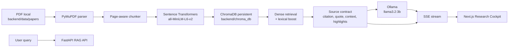

# Local Research Assistant RAG

`Local Research Assistant RAG` là research cockpit chạy hoàn toàn trên máy cá nhân để upload paper PDF, ingest nội dung, hỏi đáp RAG, xem nguồn trích dẫn, mở đúng trang PDF và highlight đoạn liên quan. Dự án được thiết kế theo hướng local-first, evidence-first, chi phí API bằng 0.

Không cần OpenAI API key, không cần dịch vụ cloud trả phí. PDF, vector database và session local đều nằm trên máy của bạn.

## Điểm Nổi Bật

- Upload, ingest, quản lý và xóa nhiều paper PDF local.
- Chat RAG bằng tiếng Việt hoặc tiếng Anh; câu trả lời đi theo ngôn ngữ câu hỏi.
- Citation rõ ràng theo dạng `[1]`, `[2]`, kèm paper, trang, score, quote và context.
- Evidence panel hiển thị trực tiếp PDF ở nửa giao diện, mở đúng page từ citation.
- Highlight từ khóa truy vấn trong quote/context bằng renderer an toàn, không dùng HTML injection.
- Streaming answer bằng SSE; nguồn có thể xuất hiện trước khi câu trả lời stream xong.
- Degraded mode khi Ollama offline: backend không crash và vẫn trả nguồn đã retrieve.
- UI responsive: desktop 3 pane, mobile/tablet dùng tab `Papers`, `Chat`, `Nguồn`.
- Palette lạnh/pastel, bố cục chuyên nghiệp, panel scroll độc lập, phù hợp workflow đọc paper.
- Toàn bộ runtime free/local: Python, FastAPI, ChromaDB, Sentence Transformers, Ollama, Next.js.

## Ảnh UI Và Chú Thích

### Desktop Research Cockpit


Chú thích:

- Bên trái là `Paper Library`: upload, danh sách paper, tìm kiếm, trạng thái ingest.
- Ở giữa là `Chat Workspace`: hội thoại, streaming answer, citation chips và ô nhập câu hỏi.
- Bên phải là `Evidence / PDF Viewer`: không gian xem nguồn chiếm gần nửa màn hình để user kiểm chứng ngay khi hỏi.
- Top bar gom trạng thái backend, Ollama/model, số chunks, export và thao tác phiên chat.

### Answer Có Citation, Quote Và PDF Page


Chú thích:

- Citation trong answer trỏ tới source tương ứng ở evidence panel.
- Source card hiển thị similarity, trang PDF, quote ngắn và context mở rộng.
- Query terms được highlight trong quote/context để user nhìn ra vì sao đoạn đó được chọn.
- PDF viewer dùng browser-native iframe để ổn định trên Next.js dev/build, vẫn mở đúng file và page.

### Mobile Chat


Chú thích:

- Mobile chuyển layout sang tab để tránh chen chúc nội dung.
- Tab `Chat` ưu tiên hội thoại và input, giữ thao tác hỏi đáp gọn trên màn hình nhỏ.

### Mobile Sources


Chú thích:

- Tab `Nguồn` gom citation, PDF preview và source cards theo chiều dọc.
- Khi user click citation ở answer, UI có thể chuyển sang nguồn liên quan để kiểm chứng.

## Kiến Trúc Tổng Quan



### Stack Chính

- Backend: Python 3.11, FastAPI, Pydantic, PyMuPDF.
- Ingestion: PDF text extraction, page metadata, deterministic chunking.
- Embedding: `sentence-transformers/all-MiniLM-L6-v2`, chạy local và cache model trên máy.
- Vector store: ChromaDB persistent local trong `backend/chroma_db`.
- Retrieval: dense vector search, lexical boost, dedupe page, filter references mặc định.
- LLM: Ollama, mặc định `llama3.2:3b`.
- Frontend: Next.js 15, React 18, TypeScript, Tailwind CSS, `lucide-react`.
- PDF visual: browser-native PDF iframe, không phụ thuộc cloud viewer.
- Scripts: PowerShell setup/start/check/stop cho Windows local.

### Cấu Trúc Thư Mục

```text
backend/
  app/
    api/             FastAPI routers: chat, ingest, files, sources
    generation/      Ollama client, prompt, streaming/degraded generation
    ingestion/       PDF parser, chunker, embedding pipeline
    retrieval/       Chroma store, retriever, evidence builder, cache
    documents.py     Safe paper resolver, file_id, page text, PDF response
    main.py          FastAPI app, CORS, lifespan warmup
  data/papers/       PDF local, ignored khỏi git
  chroma_db/         Vector database local, ignored khỏi git
  tests/             Contract/regression tests

frontend/
  app/               Next.js App Router, global style
  components/        AppShell, PaperLibrary, Chat, Evidence, PDF viewer
  lib/               API client, hooks, shared TypeScript types

scripts/             setup/start/check/stop/ingest helpers
docs/
  ARCHITECTURE.md    Bản đồ kiến trúc ngắn cho phiên mới
  implement-notes.html
                    Nhật ký triển khai theo card HTML
  assets/screenshots/
                    Ảnh UI đã capture để recap dự án
```

## Luồng Hoạt Động

1. User upload PDF từ `Paper Library` hoặc đặt file vào `backend/data/papers`.
2. Backend validate file PDF, lưu trong vùng dữ liệu local và tạo ingest job.
3. PyMuPDF parse text theo từng trang, báo lỗi rõ nếu PDF rỗng/scanned chưa OCR.
4. Chunker chia text theo page, giữ metadata để citation trả đúng trang.
5. Sentence Transformer tạo embedding local, ChromaDB lưu chunk persistent.
6. User hỏi qua chat; backend embed query và retrieve top chunks từ Chroma.
7. Retriever cộng lexical boost cho query terms, giảm trùng page, lọc references nếu user không hỏi phần tài liệu tham khảo.
8. Evidence builder tạo source contract gồm citation, quote, context, highlight ranges, PDF URL và page text URL.
9. `/api/chat/stream` emit `sources` qua SSE, sau đó stream token answer từ Ollama.
10. Frontend render answer, citation chips, source cards và PDF page liên quan.
11. User click citation để chọn source, xem quote/context highlight và mở đúng trang PDF.

## Evidence Contract

Mỗi source trả về cho frontend có dạng:

```json
{
  "rank": 1,
  "citation_id": "[1]",
  "chunk_id": "paper.pdf::page_3::chunk_0",
  "file_id": "stable-local-file-id",
  "file_name": "paper.pdf",
  "display_title": "Paper",
  "page_number": 3,
  "chunk_index": 0,
  "section_name": "Method",
  "score": 0.82,
  "quote": "short exact quoted passage...",
  "context": "larger chunk context...",
  "highlight_ranges": [
    { "start": 24, "end": 47, "kind": "query" }
  ],
  "pdf_url": "/api/files/stable-local-file-id/pdf",
  "page_text_url": "/api/files/stable-local-file-id/pages/3",
  "excerpt": "same as quote for compatibility"
}
```

Quy ước:

- `file_id` ưu tiên hash nội dung PDF; fallback deterministic theo tên file cho dữ liệu cũ.
- `pdf_url` và `page_text_url` chỉ resolve file nằm trong `backend/data/papers`.
- `highlight_ranges` tính trên quote/context và luôn được kiểm bounds.
- `citation_id` là khóa UI chính để nối answer, citation chip và source card.

## API Chính

```text
GET    /health
GET    /api/chat/health
POST   /api/chat/query
POST   /api/chat/stream
POST   /api/chat/sessions
GET    /api/chat/sessions/{session_id}
DELETE /api/chat/sessions/{session_id}
POST   /api/chat/export

POST   /api/ingest/upload
GET    /api/ingest/status/{job_id}
GET    /api/ingest/files
DELETE /api/ingest/files/{file_name}

GET    /api/files/{file_id}/pdf
GET    /api/files/{file_id}/pages/{page_number}
GET    /api/sources/{chunk_id}
```

Streaming response dùng SSE:

```text
data: {"type":"sources","sources":[...]}

data: {"type":"token","token":"..."}

data: {"type":"done","sources":[...]}
```

Frontend parser có buffer để xử lý event bị cắt giữa network chunks.

## Cách Chạy Local

Yêu cầu:

- Windows PowerShell.
- Python 3.11.
- Node.js/NPM.
- Ollama đã cài và model `llama3.2:3b`.

Đường nhanh nhất:

```powershell
.\scripts\setup_local.ps1 -InstallMissingTools
.\scripts\start_local.ps1
.\scripts\check_local.ps1
```

Dừng app:

```powershell
.\scripts\stop_local.ps1
```

Nếu port mặc định bận, script tự chọn port kế tiếp và ghi vào `.local/state.json`, ví dụ:

```text
Backend:  http://127.0.0.1:8001
Frontend: http://127.0.0.1:3001
```

Manual backend:

```powershell
cd backend
py -3.11 -m venv .venv
.\.venv\Scripts\python.exe -m pip install -r requirements.txt
Copy-Item .env.example .env
.\.venv\Scripts\python.exe -m uvicorn app.main:app --reload --port 8000
```

Manual frontend:

```powershell
cd frontend
npm install
Copy-Item .env.local.example .env.local
npm run dev
```

## Kiểm Thử Và Verify

Backend:

```powershell
.\backend\.venv\Scripts\python.exe -m compileall backend\app backend\tests
.\backend\.venv\Scripts\python.exe -m pytest .\backend\tests -q
```

Frontend:

```powershell
cd frontend
npm audit --audit-level=moderate
npm run lint
npm run build
```

Runtime smoke test:

```powershell
.\scripts\start_local.ps1
.\scripts\check_local.ps1
```

Kết quả verify trong phiên hoàn thiện:

```text
Backend pytest: 7 passed
Frontend lint: passed
Frontend build: passed
NPM audit moderate: 0 vulnerabilities
Browser smoke: citation, sources, quote highlight và PDF viewer đều hiển thị
```

## Quyết Định Kỹ Thuật Quan Trọng

### Vì Sao Dùng Browser-Native PDF Viewer?

Plan ban đầu dùng `react-pdf`, nhưng quá trình verify trên Next.js dev gặp lỗi runtime từ `pdfjs-dist`:

```text
TypeError: Object.defineProperty called on non-object
```

Sau khi thử alias legacy worker/build mà vẫn còn rủi ro, dự án chuyển sang browser-native iframe:

- Giữ trải nghiệm visual PDF đúng mục tiêu.
- Không thêm dependency phức tạp vào bundle frontend.
- Tránh crash dev overlay và ổn định hơn trên máy local.
- Vẫn hỗ trợ page anchor, zoom, open external.
- Highlight đáng tin cậy vẫn nằm ở quote/context, đúng yêu cầu evidence-first.

### Vì Sao Highlight Không Ép Overlay Trên PDF Canvas?

PDF text layer có thể khác nhau theo trình duyệt, font, encoding và loại PDF. Vì vậy dự án chọn chiến lược an toàn:

- Highlight bắt buộc trong quote/context, nơi text đã được backend kiểm soát.
- PDF visual dùng để kiểm chứng trang và ngữ cảnh rộng.
- Nếu cần pixel-perfect PDF highlight sau này, có thể bổ sung OCR/text-layer mapping như một milestone riêng.

### Vì Sao Vẫn Trả Sources Khi Ollama Offline?

Workflow nghiên cứu cần nguồn trước tiên. Khi Ollama chưa chạy hoặc model chưa load, API degrade bằng cách giữ retrieved sources để user vẫn đọc được evidence, thay vì crash hoặc trả lỗi trống.

## Recap Quá Trình Thực Hiện

### Milestone 1 - Evidence Source Contract

- Thêm schema source giàu metadata: `citation_id`, `chunk_id`, `file_id`, `quote`, `context`, `highlight_ranges`, `pdf_url`, `page_text_url`.
- Thêm document resolver để serve PDF/page text an toàn trong `backend/data/papers`.
- Cập nhật chat query/stream để frontend nhận được sources tương thích citation.

### Milestone 2 - Research Cockpit Layout

- Refactor UI thành 3 pane desktop: Paper Library, Chat Workspace, Evidence Viewer.
- Mobile/tablet chuyển sang tab để tránh overflow.
- Citation click chọn source và cập nhật evidence panel.

### Milestone 3 - PDF Viewer Và Highlight

- Thêm source cards, highlighted quote/context, copy quote, context expansion.
- Chuyển PDF visual sang browser-native iframe sau khi phát hiện lỗi `pdfjs-dist`.
- Giữ đúng mục tiêu: xem trực tiếp paper quan trọng ở nửa UI, không cần mở thủ công.

### Milestone 4 - UI Polish Song Ngữ

- Dùng palette lạnh/pastel: nền xanh rất nhạt, surface trắng, border xanh xám, primary teal.
- Copy UI ưu tiên tiếng Việt, giữ thuật ngữ English cần thiết như `Evidence`, `Chunk`, `Model`.
- Tối ưu empty state, status badge, upload zone, message bubbles và independent scrolling.

### Milestone 5 - Retrieval Và Reliability

- Dense retrieval kết hợp lexical boost để tăng khả năng bắt term user hỏi.
- Lọc references mặc định, giảm lặp chunks cùng page.
- Cache được invalidate khi ingest/delete.
- Streaming gửi lại `sources` khi `done` để UI luôn rehydrate được evidence state.

### Milestone 6 - Docs, Tests, Screenshots

- Bổ sung backend tests cho source contract, highlight ranges, PDF/page endpoint và offline/degraded paths.
- Capture desktop/mobile screenshots vào `docs/assets/screenshots`.
- Viết lại README thành tài liệu tổng quan, diễn giải UI, API, setup, test và các quyết định kỹ thuật.

## Data Safety

Không commit dữ liệu cá nhân hoặc artifact local:

```text
.env
backend/.env
frontend/.env.local
backend/data/papers/*.pdf
backend/chroma_db/*
.local/
logs/
tasks/
frontend/node_modules/
frontend/.next/
```

`.gitignore` đã bảo vệ các vùng trên. Khi commit, luôn stage explicit từng file cần đưa lên repo.

## Tài Liệu Liên Quan

- `SETUP.md`: hướng dẫn cài/chạy thực dụng.
- `docs/ARCHITECTURE.md`: bản đồ kiến trúc ngắn cho agent/session mới.
- `docs/implement-notes.html`: nhật ký triển khai theo card HTML, mới nhất ở trên.
- `AGENTS.md`: luật làm việc bắt buộc cho các phiên Codex/agent trong repo.

## Định Hướng Tiếp Theo

Những việc có thể phát triển tiếp mà vẫn giữ local/free:

- OCR cho scanned PDF bằng Tesseract hoặc pipeline local tương đương.
- Reranker local nhỏ để cải thiện ranking trên bộ paper lớn.
- Semantic section detection tốt hơn cho `Method`, `Experiment`, `Conclusion`.
- PDF highlight overlay chuẩn text-layer nếu cần độ chính xác thị giác cao hơn.
- Multi-session workspace và tagging paper theo project nghiên cứu.
