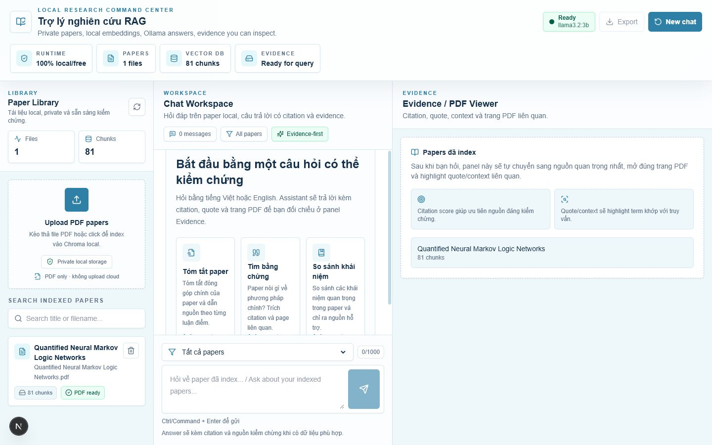
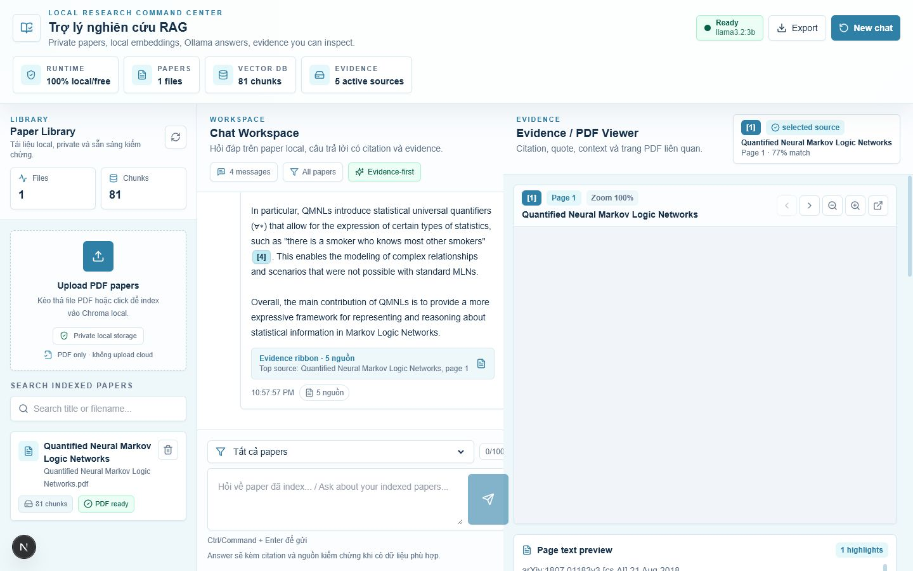
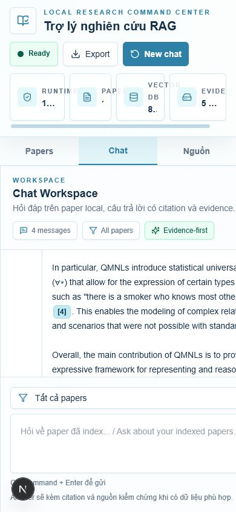
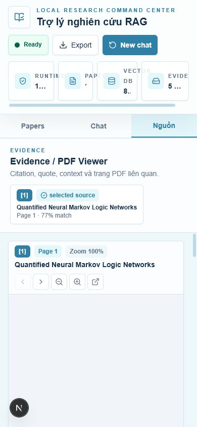
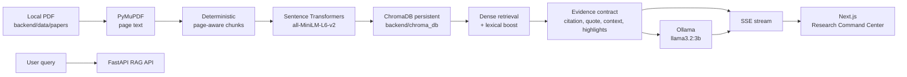

# Local Research Assistant RAG

Research Command Center chạy hoàn toàn local để upload paper PDF, index bằng embedding miễn phí, hỏi đáp RAG với Ollama, xem citation, quote/context, score và trang PDF liên quan ngay trong cùng một giao diện.

Mục tiêu chính: giúp người đọc paper kiểm chứng câu trả lời nhanh hơn, không gửi dữ liệu nghiên cứu lên dịch vụ trả phí/cloud.

## Highlights

- Local/free end to end: FastAPI, ChromaDB, Sentence Transformers, Ollama, Next.js.
- Upload và quản lý nhiều PDF trong `backend/data/papers`.
- Chat song ngữ: hỏi tiếng Việt hoặc English, answer đi theo ngôn ngữ câu hỏi.
- Citation dạng `[1]`, `[2]` nối trực tiếp answer với source cards.
- Evidence panel hiển thị paper/page, score, quote, context và PDF viewer.
- Highlight query terms trong quote/context và page text preview theo best effort.
- Streaming SSE có buffer, sources xuất hiện trước hoặc cùng lúc answer hoàn tất.
- Degraded mode khi Ollama offline: backend không crash và vẫn trả retrieved sources.
- Desktop 3-pane command center; mobile dùng tabs `Papers`, `Chat`, `Nguồn`.

## UI Gallery

### 1. Research Command Center



Giao diện desktop chia 3 vùng:

- `Paper Library`: upload PDF, search, file/chunk stats, PDF ready state.
- `Chat Workspace`: prompt starters, scope selector, cited answer và evidence ribbon.
- `Evidence / PDF Viewer`: selected source summary, PDF/page viewer, source checklist.
- Command bar phía trên hiển thị runtime local/free, số papers, vector chunks và active sources.

### 2. Answer With Evidence



Khi user hỏi, answer đi kèm citation và evidence ribbon. Panel bên phải chọn source quan trọng nhất, mở đúng page, hiện similarity score, page text preview và source cards. PDF viewer dùng browser-native iframe để ổn định trong Next.js dev/build; phần highlight đáng tin cậy nằm trong quote/context/page text preview.

### 3. Mobile Chat



Mobile giữ input và answer ở tab `Chat`, tránh ép 3 pane vào màn hình nhỏ. Citation vẫn click được để chuyển sang nguồn liên quan.

### 4. Mobile Sources



Tab `Nguồn` gom selected source, PDF preview và source cards theo chiều dọc để user kiểm chứng trên mobile.

## Architecture



Runtime stack:

- Backend: Python 3.11, FastAPI, Pydantic, PyMuPDF.
- Embedding: `sentence-transformers/all-MiniLM-L6-v2`.
- Vector store: ChromaDB persistent local.
- LLM: Ollama, default `llama3.2:3b`.
- Frontend: Next.js 15, React 18, TypeScript, Tailwind CSS, `lucide-react`.
- PDF visual: browser-native iframe via local FastAPI PDF endpoint.
- Local scripts: PowerShell setup/start/check/stop.

## User Journey

1. Upload PDF in `Paper Library`.
2. Backend validates PDF and creates an ingest job.
3. PyMuPDF extracts page text; chunker keeps page metadata.
4. Sentence Transformer embeds chunks locally.
5. ChromaDB persists vectors in `backend/chroma_db`.
6. User asks a research question.
7. Retriever combines dense search and lexical boost, then builds source references.
8. SSE sends `sources`, token stream, and `done` events to the UI.
9. UI renders answer, citation chips, evidence ribbon, PDF page and highlighted quote/context.

## Evidence Contract

Each source returned to the frontend includes enough data to render citations and evidence:

```json
{
  "rank": 1,
  "citation_id": "[1]",
  "chunk_id": "paper.pdf::page_3::chunk_0",
  "file_id": "stable-local-file-id",
  "file_name": "paper.pdf",
  "display_title": "Paper",
  "page_number": 3,
  "chunk_index": 0,
  "section_name": "Method",
  "score": 0.82,
  "quote": "short exact quoted passage...",
  "context": "larger chunk context...",
  "highlight_ranges": [
    { "start": 24, "end": 47, "kind": "query" }
  ],
  "pdf_url": "/api/files/stable-local-file-id/pdf",
  "page_text_url": "/api/files/stable-local-file-id/pages/3",
  "excerpt": "same as quote for compatibility"
}
```

Rules:

- `file_id` prefers PDF content hash; older chunks can fall back to deterministic filename hash.
- PDF/page endpoints resolve only inside `backend/data/papers`.
- Highlight ranges are bounds-checked and rendered without `dangerouslySetInnerHTML`.
- Citation id is the UI link between answer, source card and selected PDF page.

## Main API

```text
GET    /health
GET    /api/chat/health
POST   /api/chat/query
POST   /api/chat/stream
POST   /api/chat/export
POST   /api/chat/sessions
GET    /api/chat/sessions/{session_id}
DELETE /api/chat/sessions/{session_id}

POST   /api/ingest/upload
GET    /api/ingest/status/{job_id}
GET    /api/ingest/files
DELETE /api/ingest/files/{file_name}

GET    /api/files/{file_id}/pdf
GET    /api/files/{file_id}/pages/{page_number}
GET    /api/sources/{chunk_id}
```

SSE stream shape:

```text
data: {"type":"sources","sources":[...]}

data: {"type":"token","token":"..."}

data: {"type":"done","sources":[...]}
```

## Run Locally

Prerequisites:

- Windows PowerShell.
- Python 3.11.
- Node.js/NPM.
- Ollama with `llama3.2:3b`.

Fast path:

```powershell
.\scripts\setup_local.ps1 -InstallMissingTools
.\scripts\start_local.ps1
.\scripts\check_local.ps1
```

Stop:

```powershell
.\scripts\stop_local.ps1
```

The start script writes current URLs/PIDs to `.local/local-pids.json` and picks the next free port if `3000` or `8000` is busy.

Manual backend:

```powershell
cd backend
py -3.11 -m venv .venv
.\.venv\Scripts\python.exe -m pip install -r requirements.txt
Copy-Item .env.example .env
.\.venv\Scripts\python.exe -m uvicorn app.main:app --reload --port 8000
```

Manual frontend:

```powershell
cd frontend
npm install
Copy-Item .env.local.example .env.local
npm run dev
```

## Verification

Backend:

```powershell
.\backend\.venv\Scripts\python.exe -m compileall backend\app backend\tests
.\backend\.venv\Scripts\python.exe -m pytest .\backend\tests -q
```

Frontend:

```powershell
cd frontend
npm audit --audit-level=moderate
npm run lint
npm run build
```

Runtime smoke:

```powershell
.\scripts\start_local.ps1
.\scripts\check_local.ps1
```

Latest verified local state:

```text
BackendStatus      : ok
OllamaModel        : llama3.2:3b
LlmAvailable       : True
ModelLoaded        : True
VectorChunks       : 81
FrontendStatusCode : 200
```

Browser verification covered:

- Desktop 1440px: 3-pane layout visible, no body scroll drift.
- Query flow: answer streams, citations render, evidence panel updates, PDF iframe appears.
- Source cards: selected state, score bar, quote/context controls and copy quote.
- Page text preview: best-effort highlight does not crash.
- Mobile 390px: tabs work for `Chat` and `Nguồn`.

## Implementation Recap

- Monorepo setup: `backend/`, `frontend/`, `scripts/`, local-only gitignore.
- Ingestion: PDF parsing, chunk metadata, local embeddings.
- Retrieval: persistent ChromaDB, dense retrieval, lexical boost, cache invalidation.
- Generation: Ollama client, strict-context prompt, streaming and degraded responses.
- API: upload/status/files/delete, chat query/stream/export, source/PDF/page endpoints.
- UI: command center shell, paper manager, chat workspace, evidence/PDF viewer, mobile tabs.
- Reliability: source rehydration on stream `done`, viewport locked to `h-screen`, independent panel scroll.
- Documentation: README portfolio, architecture map, implementation notes and screenshots.

## Technical Decisions

- Browser-native PDF viewer replaced `react-pdf` after `pdfjs-dist` caused Next.js dev runtime instability.
- Highlight is guaranteed in quote/context/page text preview, not as pixel-perfect PDF canvas overlay.
- Ollama offline is degraded, not fatal: retrieved sources remain available for inspection.
- No paid API key is required; all core components run locally.

## Data Safety

Never commit private/local artifacts:

```text
.env
backend/.env
frontend/.env.local
backend/data/papers/*.pdf
backend/chroma_db/*
.local/
logs/
tasks/
tasks/phase-*.md
frontend/node_modules/
frontend/.next/
```

Commit workflow uses explicit staging only. Do not use `git add .`.

## Project Docs

- `SETUP.md`: practical install/run guide.
- `docs/ARCHITECTURE.md`: compact architecture map for future sessions.
- `docs/implement-notes.html`: Vietnamese implementation log, newest cards first.
- `AGENTS.md`: repository rules for Codex/agent sessions.

## Next Ideas

- OCR for scanned PDFs with a local OCR pipeline.
- Local reranker for larger paper collections.
- Better section detection for Method, Experiments and Conclusion.
- Optional PDF text-layer overlay if pixel-level highlight becomes necessary.
- Paper tags and multi-project research workspaces.
